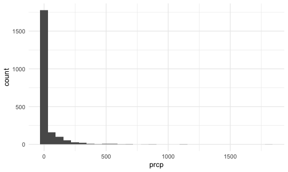

eda
================
Amrutha Banda
2025-10-02

``` r
library(tidyverse)
```

    ## ── Attaching core tidyverse packages ──────────────────────── tidyverse 2.0.0 ──
    ## ✔ dplyr     1.1.4     ✔ readr     2.1.5
    ## ✔ forcats   1.0.0     ✔ stringr   1.5.1
    ## ✔ ggplot2   3.5.2     ✔ tibble    3.2.1
    ## ✔ lubridate 1.9.4     ✔ tidyr     1.3.1
    ## ✔ purrr     1.0.4     
    ## ── Conflicts ────────────────────────────────────────── tidyverse_conflicts() ──
    ## ✖ dplyr::filter() masks stats::filter()
    ## ✖ dplyr::lag()    masks stats::lag()
    ## ℹ Use the conflicted package (<http://conflicted.r-lib.org/>) to force all conflicts to become errors

``` r
library(p8105.datasets)


knitr::opts_chunk$set(
  fig.width = 6,
  fig.asp = .6,
  out.width = "90%"
)

theme_set(theme_minimal() + theme(legend.position = "bottom"))

options(
  ggplot2.continuous.colour = "viridis",
  ggplot2.continuous.fill = "viridis"
)

scale_colour_discrete = scale_colour_viridis_d
scale_fill_discrete = scale_fill_viridis_d
```

``` r
data("weather_df")

weather_df=
  weather_df |> 
  mutate(month=floor_date(date, unit="month"))
```

Make plots

``` r
weather_df |> 
  ggplot(aes(x=prcp)) + 
  geom_histogram()
```

    ## `stat_bin()` using `bins = 30`. Pick better value with `binwidth`.

    ## Warning: Removed 15 rows containing non-finite outside the scale range
    ## (`stat_bin()`).



Check on extreme values

``` r
weather_df |> 
  filter(prcp > 1000)
```

    ## # A tibble: 3 × 7
    ##   name           id          date        prcp  tmax  tmin month     
    ##   <chr>          <chr>       <date>     <dbl> <dbl> <dbl> <date>    
    ## 1 CentralPark_NY USW00094728 2021-08-21  1130  27.8  22.8 2021-08-01
    ## 2 CentralPark_NY USW00094728 2021-09-01  1811  25.6  17.2 2021-09-01
    ## 3 Molokai_HI     USW00022534 2022-12-18  1120  23.3  18.9 2022-12-01

Look at data again

``` r
weather_df |> 
  filter(tmax >=20, tmax <=30) |>  
  ggplot(aes(x=tmin, y=tmax, color=name, shape=name )) +
  geom_point()
```


## Add groups

``` r
weather_df |> 
  group_by(name) |> 
  summarize(
    n=n()
  )
```

    ## # A tibble: 3 × 2
    ##   name               n
    ##   <chr>          <int>
    ## 1 CentralPark_NY   730
    ## 2 Molokai_HI       730
    ## 3 Waterhole_WA     730

``` r
weather_df |>  
  group_by(month) |> 
  summarize(
    n=n_distinct(date)
  )
```

    ## # A tibble: 24 × 2
    ##    month          n
    ##    <date>     <int>
    ##  1 2021-01-01    31
    ##  2 2021-02-01    28
    ##  3 2021-03-01    31
    ##  4 2021-04-01    30
    ##  5 2021-05-01    31
    ##  6 2021-06-01    30
    ##  7 2021-07-01    31
    ##  8 2021-08-01    31
    ##  9 2021-09-01    30
    ## 10 2021-10-01    31
    ## # ℹ 14 more rows

You can count directly

``` r
weather_df |> 
  count(name)
```

    ## # A tibble: 3 × 2
    ##   name               n
    ##   <chr>          <int>
    ## 1 CentralPark_NY   730
    ## 2 Molokai_HI       730
    ## 3 Waterhole_WA     730

## More interesting summaries

Compute

``` r
weather_df |>  
  group_by(month) |> 
  summarize(
    mean_tmax= mean(tmax, na.rm=TRUE),
    median_tmin=median(tmin,na.rm=TRUE),
    sd_prcp= sd(prcp,na.rm=TRUE)
  )
```

    ## # A tibble: 24 × 4
    ##    month      mean_tmax median_tmin sd_prcp
    ##    <date>         <dbl>       <dbl>   <dbl>
    ##  1 2021-01-01     10.9         0.6    113. 
    ##  2 2021-02-01      9.82       -1.65    83.4
    ##  3 2021-03-01     13.7         5      107. 
    ##  4 2021-04-01     16.8         8.05    37.0
    ##  5 2021-05-01     19.6        11.1     48.1
    ##  6 2021-06-01     24.3        17.8     38.6
    ##  7 2021-07-01     25.2        21.1     96.6
    ##  8 2021-08-01     25.2        21.1    141. 
    ##  9 2021-09-01     22.4        17.5    200. 
    ## 10 2021-10-01     18.2        13.9    112. 
    ## # ℹ 14 more rows

Name and Month

``` r
weather_df |>  
  group_by(name,month) |> 
  summarize(
    mean_tmax= mean(tmax, na.rm=TRUE),
    median_tmin=median(tmin,na.rm=TRUE),
    sd_prcp= sd(prcp,na.rm=TRUE)
  )
```

    ## `summarise()` has grouped output by 'name'. You can override using the
    ## `.groups` argument.

    ## # A tibble: 72 × 5
    ## # Groups:   name [3]
    ##    name           month      mean_tmax median_tmin sd_prcp
    ##    <chr>          <date>         <dbl>       <dbl>   <dbl>
    ##  1 CentralPark_NY 2021-01-01      4.27       -0.5     47.3
    ##  2 CentralPark_NY 2021-02-01      3.87       -1.85    98.1
    ##  3 CentralPark_NY 2021-03-01     12.3         5       71.3
    ##  4 CentralPark_NY 2021-04-01     17.6         8.05    52.4
    ##  5 CentralPark_NY 2021-05-01     22.1        11.1     74.7
    ##  6 CentralPark_NY 2021-06-01     28.1        18.0     43.3
    ##  7 CentralPark_NY 2021-07-01     28.4        21.1    151. 
    ##  8 CentralPark_NY 2021-08-01     28.8        22.2    236. 
    ##  9 CentralPark_NY 2021-09-01     24.8        17.5    333. 
    ## 10 CentralPark_NY 2021-10-01     19.9        13.9    151. 
    ## # ℹ 62 more rows

This is still a dataframe!!

``` r
weather_df |> 
  group_by(name, month) |> 
  summarize(
    mean_tmax= mean(tmax, na.rm=TRUE)
  ) |> 
  ggplot(aes(x=month, y=mean_tmax, color=name))+
  geom_point() +
  geom_line()
```

    ## `summarise()` has grouped output by 'name'. You can override using the
    ## `.groups` argument.


``` r
weather_df |> 
  group_by(name, month) |> 
  summarize(
    mean_tmax= mean(tmax, na.rm=TRUE)
  ) |> 
  pivot_wider(
    names_from=name, 
    values_from= mean_tmax
  ) |> 
  knitr:: kable(digits=2)
```

    ## `summarise()` has grouped output by 'name'. You can override using the
    ## `.groups` argument.

| month      | CentralPark_NY | Molokai_HI | Waterhole_WA |
|:-----------|---------------:|-----------:|-------------:|
| 2021-01-01 |           4.27 |      27.62 |         0.80 |
| 2021-02-01 |           3.87 |      26.37 |        -0.79 |
| 2021-03-01 |          12.29 |      25.86 |         2.62 |
| 2021-04-01 |          17.61 |      26.57 |         6.10 |
| 2021-05-01 |          22.08 |      28.58 |         8.20 |
| 2021-06-01 |          28.06 |      29.59 |        15.25 |
| 2021-07-01 |          28.35 |      29.99 |        17.34 |
| 2021-08-01 |          28.81 |      29.52 |        17.15 |
| 2021-09-01 |          24.79 |      29.67 |        12.65 |
| 2021-10-01 |          19.93 |      29.13 |         5.48 |
| 2021-11-01 |          11.54 |      28.85 |         3.53 |
| 2021-12-01 |           9.59 |      26.19 |        -2.10 |
| 2022-01-01 |           2.85 |      26.61 |         3.61 |
| 2022-02-01 |           7.65 |      26.83 |         2.99 |
| 2022-03-01 |          11.99 |      27.73 |         3.42 |
| 2022-04-01 |          15.81 |      27.72 |         2.46 |
| 2022-05-01 |          22.25 |      28.28 |         5.81 |
| 2022-06-01 |          26.09 |      29.16 |        11.13 |
| 2022-07-01 |          30.72 |      29.53 |        15.86 |
| 2022-08-01 |          30.50 |      30.70 |        18.83 |
| 2022-09-01 |          24.92 |      30.41 |        15.21 |
| 2022-10-01 |          17.43 |      29.22 |        11.88 |
| 2022-11-01 |          14.02 |      27.96 |         2.14 |
| 2022-12-01 |           6.76 |      27.35 |        -0.46 |

## mutate with groups

``` r
weather_df |> 
  group_by(name) |> 
  mutate(
    mean_tmax=mean(tmax, na.rm=TRUE), 
    center_tmax= tmax-mean_tmax
  ) |> 
  ggplot(aes(x=date,y=center_tmax, color=name)) +
  geom_point()
```

    ## Warning: Removed 17 rows containing missing values or values outside the scale range
    ## (`geom_point()`).


Look for cold days

``` r
weather_df |>  
  group_by(name, month) |> 
  mutate(temp_rank= min_rank(tmax)) |> 
  filter(temp_rank < 2)
```

    ## # A tibble: 92 × 8
    ## # Groups:   name, month [72]
    ##    name           id          date        prcp  tmax  tmin month      temp_rank
    ##    <chr>          <chr>       <date>     <dbl> <dbl> <dbl> <date>         <int>
    ##  1 CentralPark_NY USW00094728 2021-01-29     0  -3.8  -9.9 2021-01-01         1
    ##  2 CentralPark_NY USW00094728 2021-02-08     0  -1.6  -8.2 2021-02-01         1
    ##  3 CentralPark_NY USW00094728 2021-03-02     0   0.6  -6   2021-03-01         1
    ##  4 CentralPark_NY USW00094728 2021-04-02     0   3.9  -2.1 2021-04-01         1
    ##  5 CentralPark_NY USW00094728 2021-05-29   117  10.6   8.3 2021-05-01         1
    ##  6 CentralPark_NY USW00094728 2021-05-30   226  10.6   8.3 2021-05-01         1
    ##  7 CentralPark_NY USW00094728 2021-06-11     0  20.6  16.7 2021-06-01         1
    ##  8 CentralPark_NY USW00094728 2021-06-12     0  20.6  16.7 2021-06-01         1
    ##  9 CentralPark_NY USW00094728 2021-07-03    86  18.9  15   2021-07-01         1
    ## 10 CentralPark_NY USW00094728 2021-08-04     0  24.4  19.4 2021-08-01         1
    ## # ℹ 82 more rows

What about lags?

``` r
weather_df |> 
  group_by(name) |> 
  mutate(lagged_tmax= lag(tmax)) ##here the order matters 
```

    ## # A tibble: 2,190 × 8
    ## # Groups:   name [3]
    ##    name           id         date        prcp  tmax  tmin month      lagged_tmax
    ##    <chr>          <chr>      <date>     <dbl> <dbl> <dbl> <date>           <dbl>
    ##  1 CentralPark_NY USW000947… 2021-01-01   157   4.4   0.6 2021-01-01        NA  
    ##  2 CentralPark_NY USW000947… 2021-01-02    13  10.6   2.2 2021-01-01         4.4
    ##  3 CentralPark_NY USW000947… 2021-01-03    56   3.3   1.1 2021-01-01        10.6
    ##  4 CentralPark_NY USW000947… 2021-01-04     5   6.1   1.7 2021-01-01         3.3
    ##  5 CentralPark_NY USW000947… 2021-01-05     0   5.6   2.2 2021-01-01         6.1
    ##  6 CentralPark_NY USW000947… 2021-01-06     0   5     1.1 2021-01-01         5.6
    ##  7 CentralPark_NY USW000947… 2021-01-07     0   5    -1   2021-01-01         5  
    ##  8 CentralPark_NY USW000947… 2021-01-08     0   2.8  -2.7 2021-01-01         5  
    ##  9 CentralPark_NY USW000947… 2021-01-09     0   2.8  -4.3 2021-01-01         2.8
    ## 10 CentralPark_NY USW000947… 2021-01-10     0   5    -1.6 2021-01-01         2.8
    ## # ℹ 2,180 more rows

Use the variables you create

``` r
weather_df |> 
  group_by(name) |> 
  mutate(
    temp_change= tmax-lag(tmax)
  ) |> 
  summarize(
    sd_tmax_change= sd(temp_change, na.rm=TRUE),
    tmax_change_tmax= max(temp_change, na.rm=TRUE)
  )
```

    ## # A tibble: 3 × 3
    ##   name           sd_tmax_change tmax_change_tmax
    ##   <chr>                   <dbl>            <dbl>
    ## 1 CentralPark_NY           4.43             12.2
    ## 2 Molokai_HI               1.24              5.6
    ## 3 Waterhole_WA             3.04             11.1

``` r
weather_df |> 
  group_by(name) |> 
  mutate(
    temp_change= tmax-lag(tmax),
    change_rank= min_rank(desc(temp_change))
  ) |> 
  filter(
    min_rank(desc(temp_change)) <2
  )
```

    ## # A tibble: 4 × 9
    ## # Groups:   name [3]
    ##   name     id    date        prcp  tmax  tmin month      temp_change change_rank
    ##   <chr>    <chr> <date>     <dbl> <dbl> <dbl> <date>           <dbl>       <int>
    ## 1 Central… USW0… 2022-03-06    15  20     6.1 2022-03-01        12.2           1
    ## 2 Molokai… USW0… 2021-01-19     0  27.8  21.1 2021-01-01         5.6           1
    ## 3 Molokai… USW0… 2022-11-29     0  27.8  19.4 2022-11-01         5.6           1
    ## 4 Waterho… USS0… 2022-12-22    76   1.5 -17.2 2022-12-01        11.1           1

## Learning Assessment 1

Revisiting PULSE

``` r
pulse_df= 
  haven:: read_sas("data_import_examples/public_pulse_data.sas7bdat") |> 
  janitor::clean_names() |> 
  pivot_longer(
    bdi_score_bl:bdi_score_12m,
    names_to="visit", 
    names_prefix= "bdi_score",
    values_to= "bdi"
  ) |> 
  mutate(visit= fct_inorder(visit)) 

pulse_df |> 
  ggplot(aes(x= visit, y= bdi)) + 
  geom_boxplot()
```

    ## Warning: Removed 879 rows containing non-finite outside the scale range
    ## (`stat_boxplot()`).


``` r
pulse_df |> 
  group_by(visit) |> 
  summarize(
    mean_bdi= mean(bdi,na.rm=TRUE),
    median_bdi= median(bdi, na.rm=TRUE)
  ) |> 
  knitr:: kable(digits=2)
```

| visit | mean_bdi | median_bdi |
|:------|---------:|-----------:|
| \_bl  |     7.99 |          6 |
| \_01m |     6.05 |          4 |
| \_06m |     5.67 |          4 |
| \_12m |     6.10 |          4 |

## Learning Assessment 2

## Learning Assessment 3
