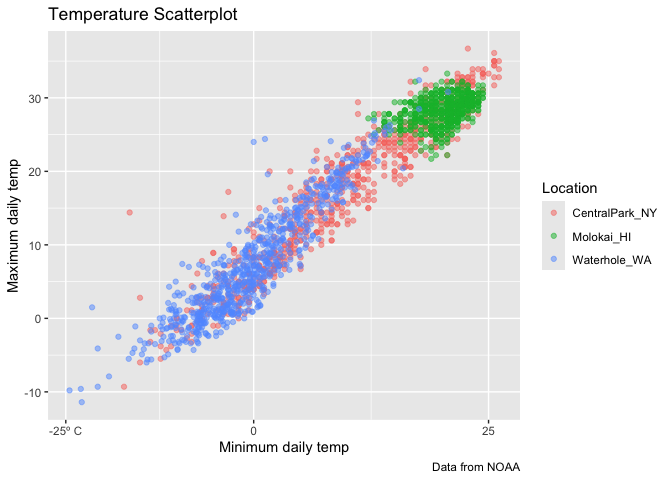

visualization_2
================
Amrutha Banda
2025-09-30

Import the weatehr data

``` r
data("weather_df")
```

Lets make out basic scatterplot

``` r
weather_df |> 
  ggplot(aes(x = tmin, y = tmax)) + 
  geom_point(aes(color = name), alpha = .5) +
  labs(
    x= "Minimum daily temp", 
    y= "Maximum daily temp", 
    title= "Temperature Scatterplot", 
    caption= "Data from NOAA", 
    color= "Location"
  )
```

    ## Warning: Removed 17 rows containing missing values or values outside the scale range
    ## (`geom_point()`).

<!-- -->

## Scales

breaks changes the scale on the scatterplot

``` r
weather_df |> 
  ggplot(aes(x = tmin, y = tmax)) + 
  geom_point(aes(color = name), alpha = .5) +
  labs(
    x= "Minimum daily temp", 
    y= "Maximum daily temp", 
    title= "Temperature Scatterplot", 
    caption= "Data from NOAA", 
    color= "Location" 
)+ 
  scale_x_continuous(
    breaks = c(-20, 0, 25), 
    labels = c("-25º C", "0", "25"))
```

    ## Warning: Removed 17 rows containing missing values or values outside the scale range
    ## (`geom_point()`).

<!-- -->
